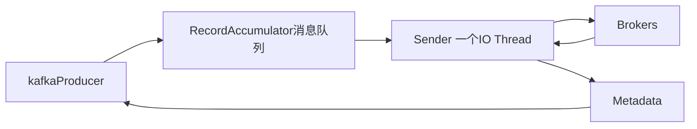

# kafka源码解析3------producer metadata的数据结构与读取、更新策略

```mermaid
graph LR
	A[kafkaProducer] --> B[RecordAccumulator消息队列]
	B --> C[Sender 一个IO Thread]
	C --> D[Brokers]
	C --> E[Metadata]
	E --> A
	D --> C
```

